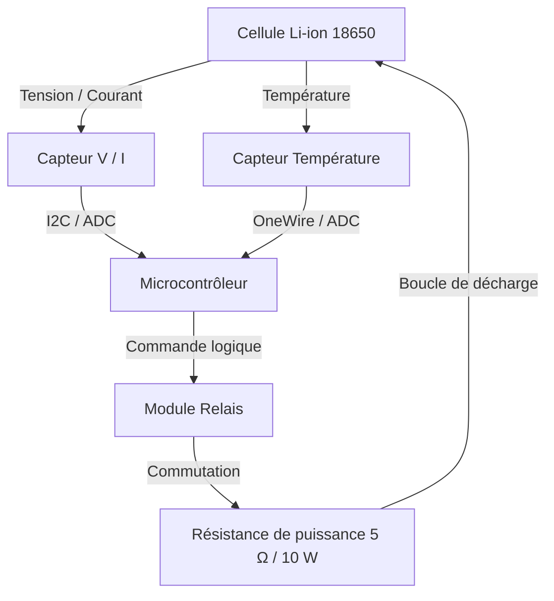

# 🔋 Banc d'Essai & Caractérisation de Batteries Li-ion

> **Projet d'ingénierie embarquée : banc de test automatisé pour mesure de capacité (mAh / Wh), évaluation de la résistance interne (DCIR) et suivi de l'état de santé (SoH) de cellules 18650.**

---

## 📌 Présentation du Projet

Ce projet consiste en la conception d'un banc de test automatisé pour caractériser des cellules Li-ion (format 18650). Le système assure une décharge contrôlée à travers une résistance de puissance, mesure en temps réel les paramètres physiques ($V, I, T$) et isole physiquement la batterie via un **relais électromécanique** dès l'atteinte des seuils de sécurité.

  
  ## 🚀 Fonctionnalités Principales

* *Acquisition & Métrologie en temps réel :*
  * Mesure continue de la tension de cellule ($V$), du courant ($I$) et de la puissance ($P$) via le module INA219.
  * Suivi thermique de la batterie par sonde étanche DS18B20 ($1\text{-Wire}$).
  * Calcul de la capacité réelle ($\text{mAh}$) et de l'énergie restituée ($\text{Wh}$) par intégration numérique (méthode des trapèzes).

* *Gestion des Cycles Charge / Décharge :*
  * Séquençage automatique des phases : Charge complet ➔ Temps de repos (stabilisation) ➔ Décharge contrôlée.
  * Banc de décharge à courant/charge résistive piloté par étage de puissance.

* *Sécurités & Protection Électronique :*
  * Coupure automatique en sous-tension (UVLO) à $2{,}8\text{ V}$ pour éviter la dégradation chimique de la cellule Li-ion.
  * Protection contre les surchauffes avec coupure d'urgence si $T \ge 50^\circ\text{C}$.
  * Asservissement du refroidissement actif (ventilateur piloté en PWM/relais selon le seuil de température).

* *Exportation & Analyse de Données :*
  * Envoi des données de télémétrie par liaison série pour traçabilité et traçage des courbes de décharge ($V = f(t)$ et $T = f(t)$).

    ### Objectifs clés
* **Sécurité absolue :** Isolation immédiate par relais en cas de sous-tension ($< 2{,}8\text{ V}$) ou de surchauffe ($> 60^\circ\text{C}$).
* **Caractérisation :** Calcul de la capacité réelle par intégration numérique ($mAh$) et mesure de la résistance interne ($DCIR$).
* **Répétabilité :** Journalisation automatique des données de décharge à $1\text{ Hz}$.
  
    
## 📌 Progression du projet 
[Consulter le journal de bord](./docs/JOURNAL.md)
- [x] Commander le matériel
- [ ] Test du matériel
- [ ] Câblage
- [ ] Création du schéma KiCad
- [ ] Phase 1 : Charge puis décharge batterie
- [ ] Phase 2 : Charge puis repos puis décharge de batterie
- [ ] Phase 3 : Plusieurs cycles automatiques de charges/décharges et ajout du ventilateur
- [ ] Phase 4 : Stockage d'informations et calcul de la capacité
- [ ] Phase 5 : Création en 3D du châssis et du PCB
---

## 🛠️ Architecture du Système

## 🛠️ Matériel & Logiciels Utilisés

### 📦 Composants Électroniques & Matériel
* *Microcontrôleur :* Arduino / ESP32 (sélectionne celui que tu utilises)
* *Mesure de courant & tension :* Module INA219 ($I^2C$)
* *Sondes de température :* Sondes étanches DS18B20 ($1\text{-Wire}$)
* *Gestion de charge :* Module TP4056 (avec protection intégrée)
* *Dissipation / Charge fictive :* Résistance de puissance $5\ \Omega$ + Relais
* *Refroidissement :* Ventilateur $5\text{ V}  \text{ }$ piloté
* *Support batterie :* Support pour cellule Li-ion 18650

### 💻 Logiciels & Outils de Conception
* *Saisie de schéma & PCB :* KiCad
* *Modélisation 3D (Châssis) :* FreeCAD
* *Développement Firmware :* Arduino IDE 
* *Gestion de projet & Traçabilité :* Git & GitHub
